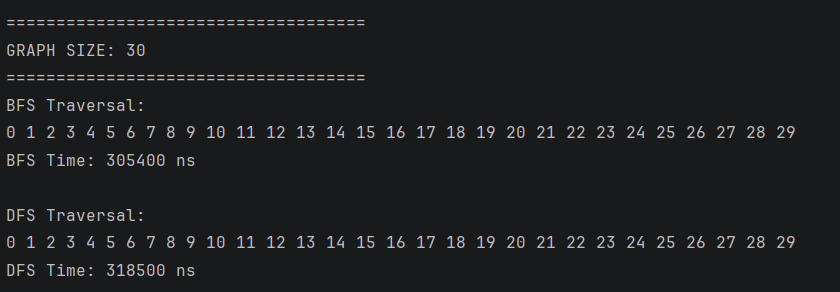
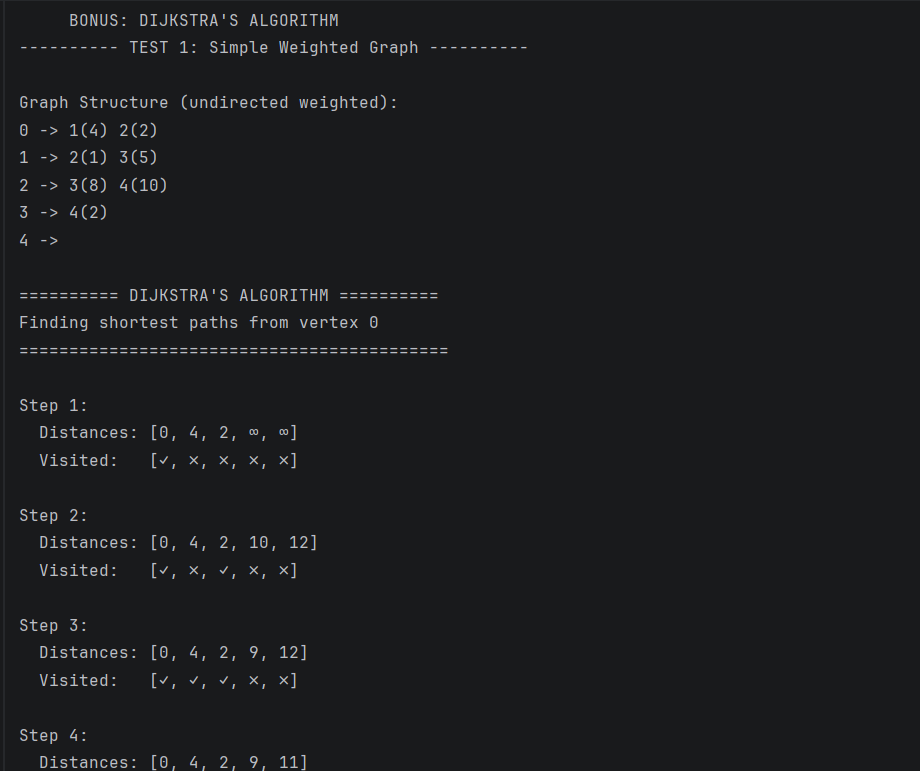
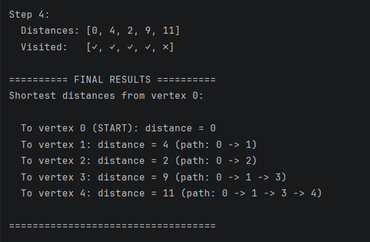
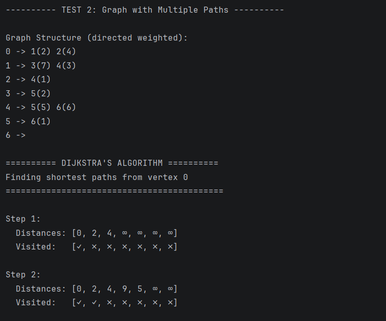
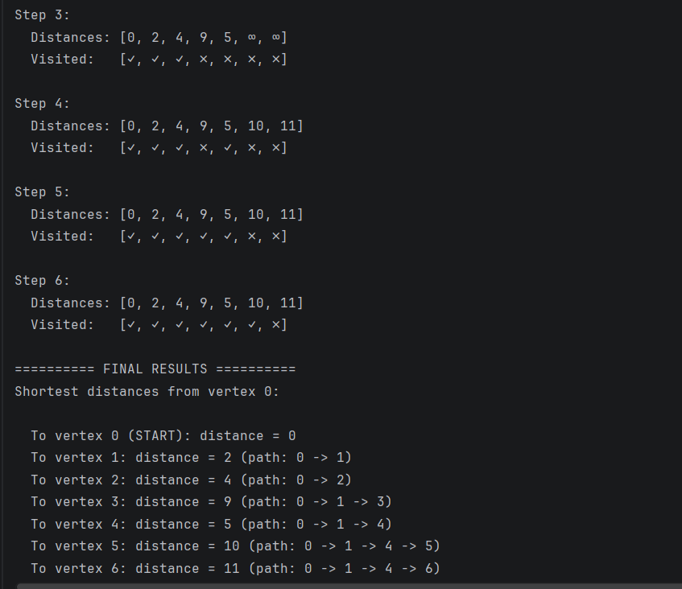
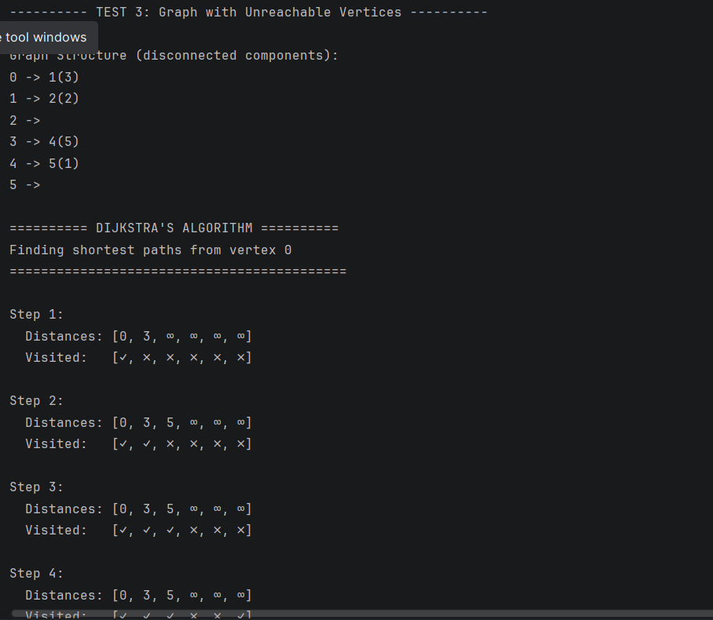
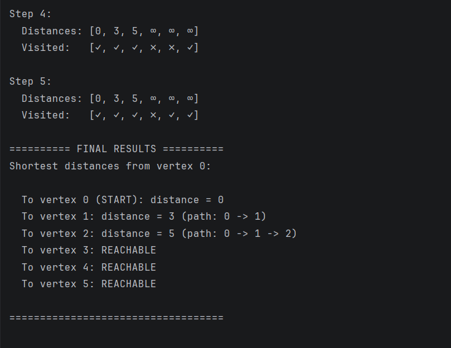
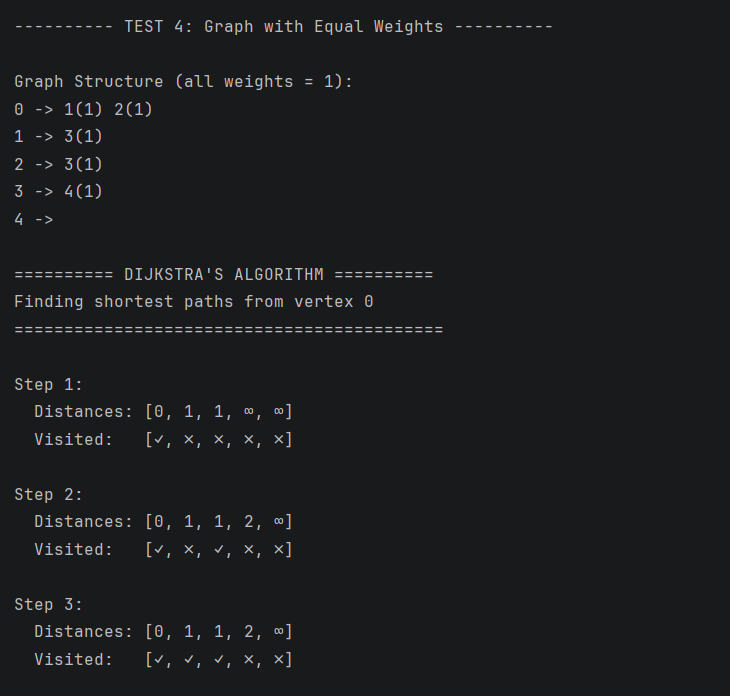
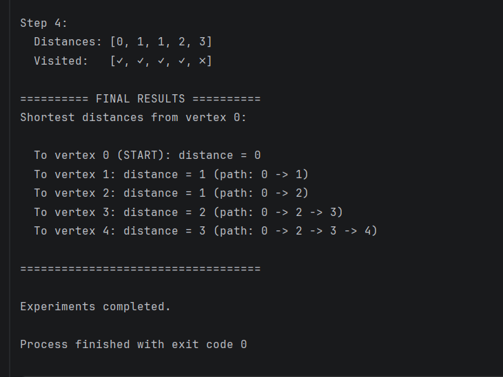

# Assignment 4: Graph Traversal and Representation System


---
## IT-2502 Rinatuly Miras

---

# Experiment Class

Used for:
- Running tests
- Measuring execution time
- Comparing BFS and DFS
---
# BFS Algorithm

```Breadth-First Search explores vertices level by level.```

Steps:
1. Start from a vertex
2. Add it to queue
3. Visit neighbors
4. Repeat until queue is empty
## Data Structure
- Queue
# Time Complexity
`O(V + E)`
Where:

- V = number of vertices
- E = number of edges
 
## Use Cases
- Shortest path
- Navigation systems
- Social networks
---
# DFS Algorithm

``Depth-First Search explores vertices deeply before backtracking.``

Steps:
1. Start from a vertex
2. Visit neighbor
3. Continue recursively
4. Backtrack when necessary
## Data Structure
- Recursion stack
## Time Complexity
`O(V + E)`
## Use Cases
- Path finding
- Cycle detection
- Maze solving
---
# Experimental Results
1. 
2. 
3.  

---

# Analysis Questions
1. How does graph size affect BFS and DFS performance?

Larger graphs require more processing time because more vertices and edges are visited.

2. Which traversal is faster?

Both algorithms showed similar performance.
DFS was slightly faster in some tests.

3. Do results match O(V + E)?

Yes.
Traversal time increased as the number of vertices and edges increased.

4. How does graph structure affect traversal order?

Different edge connections change the order in which vertices are visited.

5. When is BFS preferred over DFS?

BFS is preferred when the shortest path is needed.

6. What are the limitations of DFS?

DFS does not guarantee the shortest path and may cause deep recursion.

---
## BFS vs DFS
|  BFS                     | DFS                              |
|--------------------------| -------------------------------- |
| Uses Queue               | Uses Recursion/Stack             |
| Level-by-level traversal | Depth traversal                  |
| Finds shortest path      | Does not guarantee shortest path |
| More memory usage        | Less memory in some cases        |


## Reflection

- This assignment improved understanding of graph structures and traversal algorithms.
- BFS and DFS use different traversal strategies, but both are important for graph processing.
- The most challenging part was implementing traversal correctly using visited vertices.

# Bonus Task: Dijkstra's Algorithm (Shortest Path)

## Task Description
Implement Dijkstra's Algorithm to find the shortest path from a starting vertex to all other vertices in a weighted graph.

## Implementation Details

### What I Added

1. **Edge Weight Support** - Edge class now has a `weight` field
2. **Weighted Graph Structure** - Graph stores weighted edges in adjacency list
3. **Dijkstra's Algorithm** - Method `void dijkstra(int start)`

# Why This Approach?
- Simple arrays instead of priority queue (as allowed in requirements)
- Time complexity: O(V²) where V = number of vertices
- Space complexity: O(V)

# How Dijkstra Works (Step by Step)
## The Process:
1. Set distance to START vertex = 0, all others = ∞ (infinity)
2. Mark all vertices as UNVISITED
3. Repeat until all vertices visited:
- Pick UNVISITED vertex with SMALLEST distance
- Mark it as VISITED
- Check all neighbors: can we get a SHORTER path through this vertex?
- If yes, UPDATE the neighbor's distance

Step 1:
Distances: [0, 4, 2, ∞, ∞]

Visited:   [✓, ✗, ✗, ✗, ✗]

Explanation:

[0, 4, 2, ∞, ∞] = distances from vertex 0

Vertex 0: distance 0 (start vertex)

Vertex 1: distance 4 (direct edge 0→1 weight 4)

Vertex 2: distance 2 (direct edge 0→2 weight 2)

Vertex 3: ∞ (not reachable yet)

Vertex 4: ∞ (not reachable yet)

[✓, ✗, ✗, ✗, ✗] = visited vertices

Vertex 0: ✓ (processed)

Others: ✗ (not processed yet)

What happened: Selected vertex 0 (smallest distance), marked visited, updated neighbors (1 and 2)

# DIJKSTRA OUTPUT:
## Test 1:



---
## Test 2:



---
## Test 3:



---
## Test 4:

