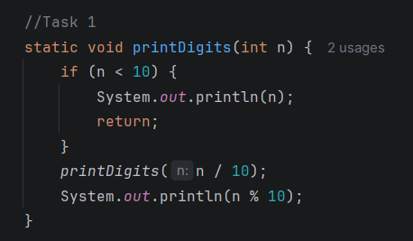

# Assignment 1 - Recursion

## Student Information

Name: Rinatuly Miras
Group: IT-2502

---

# Summary

In this assignment, I implemented 10 recursive algorithms without using loops.
I applied recursion to solve problems with numbers, arrays, and strings.

# Task 1 - Print Digits

- Description: Prints each digit of a number using recursion.
Screenshot:

# Task 2 - Average of Elements

- Description: Calculates sum recursively and finds average.
Screenshot: 

# Task 3 - Prime Number Check

- Description: Checks if a number is prime using recursion.
Screenshot: (add here)

# Task 4 - Factorial

- Description: Calculates factorial using recursion.
Screenshot: (add here)

# Task 5 - Fibonacci

- Description: Finds n-th Fibonacci number recursively.
Screenshot: (add here)

# Task 6 - Power Function

- Description: Calculates a^n using recursion.
Screenshot: (add here)

# Task 7 - Reverse Output

- Description: Prints numbers in reverse order using recursion.
Screenshot: (add here)

# Task 8 - Check Digits in String

- Description: Checks if string contains only digits.
Screenshot: (add here)

# Task 9 - Count Characters

- Description: Counts characters in string recursively.
Screenshot: (add here)

# Task 10 - GCD

- Description: Finds GCD using Euclidean algorithm.
Screenshot: (add here)
